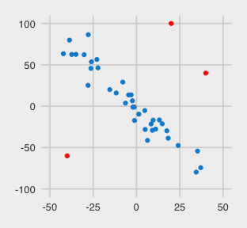
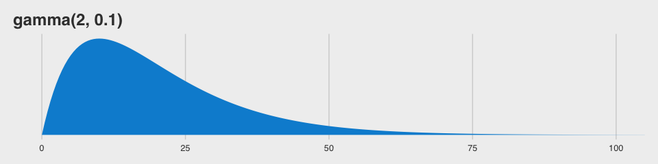
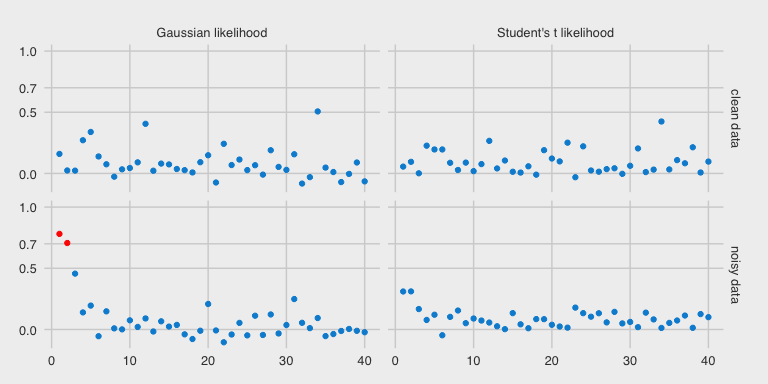

Bayesian Robust Correlations with Student’s *t* in brms
=======================================================

The purpose of this project is to demonstrate the advantages of the Student's *t*-distribution to get Bayesian correlations for data with outliers.

This project is a direct consequence of Adrian Baez-Ortega's great blog, "[Bayesian robust correlation with Stan in R (and why you should use Bayesian methods)](https://baezortega.github.io/2018/05/28/robust-correlation/)". Baez-Ortega worked out the approach and code for use with [Stan](http://mc-stan.org), directly. Since I'm a fan of the [brms](https://github.com/paul-buerkner/brms) package, it seemed only right that we might extend Baez-Ortega's method to brms. So to pay respects where they're due, the synthetic data, priors, and other model settings are largely the same as Baez-Ortega used in his blog.

For this project, I’m presuming you are vaguely familiar with linear regression, familiar with the basic differences between frequentist and Bayesian approaches to fitting models, and have a sense that the issue of outlier values is a pickle worth contending with. All code in is [R](https://www.r-bloggers.com/why-use-r-five-reasons/), with a heavy use of the [tidyverse](http://style.tidyverse.org)--which you might learn a lot about [here, especially chapter 5](http://r4ds.had.co.nzhttp://r4ds.had.co.nz)--, and, of course, Bürkner's [brms](https://github.com/paul-buerkner/brms).

What's the deal?
----------------

Pearson's correlations are designed to quantify the linear relationship between two normally distributed variables. The normal distribution and its multivariate generalization, the multivariate normal distribution, are sensitive to outliers. When you have well-behaved synthetic data, this isn't an issue. But if you work with wild and rough real-world data, this is a problem. One can have data for which the vast majority of cases are well-characterized by a nice liner relationship, but have a few odd cases for which that relationship does not hold. And if those odd cases happen to be overly influential--sometimes called leverage points--the resulting Pearson's correlation coefficient might look off.

The normal distribution is a special case of Student's *t*-distribution with the *ν* parameter (i.e., *nu*, degree of freedom) set to infinity. However, when *ν* is small, Student's *t*-distribution is more robust to multivariate outliers. I'm not going to cover why in any detail. For that you've got [Baez-Ortega's blog](https://baezortega.github.io/2018/05/28/robust-correlation/), an even earlier blog from [Rasmus Bååth](http://www.sumsar.net/blog/2013/08/bayesian-estimation-of-correlation/), and textbook treatments on the topic by [Gelman & Hill (2007, chapter 6)](http://www.stat.columbia.edu/~gelman/arm/) and [Kruschke (2014, chapter 16)](https://sites.google.com/site/doingbayesiandataanalysis/). Here we'll get a quick sense of how vulnerable Pearson's correlations--with their reliance on the Gaussian--are to outliers, we'll demonstrate how fitting correlations within the Bayesian paradigm using the conventional Gaussian likelihood is similarly vulnerable to distortion, and then demonstrate how Student's *t*-distribution can save the day. And importantly, we'll do the bulk of this with the brms package.

We need data
------------

To start off, we'll make a multivariate normal simulated data set using the same steps Baez-Ortega's used.

``` r
library(mvtnorm)
library(tidyverse)

sigma <- c(20, 40)  # the variances
rho   <- -0.95      # the desired correlation

# here's the variance, covariance matrix
cov.mat <- 
  matrix(c(sigma[1] ^ 2,
           sigma[1] * sigma[2] * rho,
           sigma[1] * sigma[2] * rho,
           sigma[2] ^ 2),
         nrow = 2, byrow = T)

# after setting our seed, we're ready to simulate with `rmvnorm()`
set.seed(210191)
x.clean <- 
  rmvnorm(n = 40, sigma = cov.mat) %>% 
  as_tibble() %>% 
  rename(x = V1,
         y = V2)
```

Here we make our second data set, `x.noisy`, which is identical to our well-behaved `x.clean` data, but with the first three cases transformed to outlier values.

``` r
x.noisy <- x.clean
x.noisy[1:3,] <-
  matrix(c(-40, -60,
           20, 100,
           40, 40),
         nrow = 3, byrow = T)
```

Finally, we'll add an `outlier` index to the data sets, which will help us with plotting.

``` r
x.clean <-
  x.clean %>% 
  mutate(outlier = 0) %>% 
  mutate(outlier = as.factor(outlier))

x.noisy <- 
  x.noisy %>% 
  mutate(outlier = c(rep(1, 3), rep(0, 37))) %>% 
  mutate(outlier = as.factor(outlier))
```

The plot below shows what the `x.clean` data look like. I'm a fan of [FiveThirtyEight](http://fivethirtyeight.com), so we'll use a few convenience functions from the handy [ggthemes package](https://github.com/jrnold/ggthemes) to give our plots a FiveThirtyEight-like feel.

``` r
library(ggthemes)

x.clean %>% 
  ggplot(aes(x = x, y = y, color = outlier)) +
  geom_point() +
  scale_color_fivethirtyeight() +
  coord_cartesian(xlim = -50:50,
                  ylim = -100:100) +
  theme_fivethirtyeight() +
  theme(legend.position = "none")
```


And here are the `x.noisy` data.

``` r
x.noisy %>% 
  ggplot(aes(x = x, y = y, color = outlier)) +
  geom_point() +
  scale_color_fivethirtyeight() +
  coord_cartesian(xlim = -50:50,
                  ylim = -100:100) +
  theme_fivethirtyeight() +
  theme(legend.position = "none")
```



The three outliers are in red. Even in their presence, the old interocular test suggests there is a pronounced overall trend in the data. I would like a correlation procedure that's capable of capturing that overall trend.

How does old Pearson hold up?
-----------------------------

A quick way to get a Pearson's correlation coefficient in R is with `cor()`, which does a nice job recovering the correlation we simulated the `x.clean` data with:

``` r
cor(x.clean$x, x.clean$y)
```

    ## [1] -0.959702

However, things fall apart if you use `cor()` on `x.noisy`.

``` r
cor(x.noisy$x, x.noisy$y)
```

    ## [1] -0.6365649

So even though most of the `x.noisy` data continue to show a clear strong correlation, three outlier values reduce the Pearson's correlation a third of the way toward zero Let's see what happens when we go Bayesian.

Bayesian correlations in brms
-----------------------------

Bürkner's brms is a general purpose interface for fitting all manner of Bayesian regression models with Stan as the engine under the hood. It has popular [lme4](https://cran.r-project.org/web/packages/lme4/index.html)-like syntax and offers a variety of convenience functions for post processing. Let's load it up.

``` r
library(brms)
```

### First with the Gaussian likelihood.

I’m not going to spend a lot of time walking through the syntax in the main brms function, `brm()`. You can learn all about that [here](https://github.com/paul-buerkner/brms). But our particular use of `brm()` requires a few fine points.

One doesn’t always think about bivariate correlations within the regression paradigm. But they work just fine. Within brms, you use the conventional Gaussian likelihood (i.e., `family = gaussian`), use the `cbind()` syntax to set up a [multivariate model](https://cran.r-project.org/web/packages/brms/vignettes/brms_multivariate.html), and fit an intercept-only model. For each variable specified in `cbind()`, you’ll estimate an intercept (i.e., mean, *μ*) and sigma (i.e., *σ*, often called a residual variance). Since there are no predictors in the model, the residual variance is just the variance and the brms default for such models is to allow the residual variances to covary. But since variances are parameterized in the standard deviation metric in brms, the residual variances and their covariance are *SD*s and their correlation, respectively.

Here’s what it looks like in practice.

``` r
f0 <- 
  brm(data = x.clean, family = gaussian,
      cbind(x, y) ~ 1,
      prior = c(set_prior("normal(0, 100)", class = "Intercept"),
                set_prior("normal(0, 100)", class = "sigma", resp = "x"),
                set_prior("normal(0, 100)", class = "sigma", resp = "y"),
                set_prior("lkj(1)", class = "rescor")),
       iter = 2000, warmup = 500, chains = 4, cores = 4, seed = 210191)
```

In a typical Bayesian workflow, you’d examine the quality of the chains with trace plots. The easy way to do that in brms is with `plot()`. E.g., to get the trace plots for our first model, you’d code `plot(f0)`. The trace plots look fine for all models in this project. For the sake of space, I’ll leave their inspection as an exercise for the interested reader.

Our priors and such mirror those in Baez-Ortega's blog. Here are the results.

``` r
print(f0)
```

    ##  Family: MV(gaussian, gaussian) 
    ##   Links: mu = identity; sigma = identity
    ##          mu = identity; sigma = identity 
    ## Formula: x ~ 1 
    ##          y ~ 1 
    ##    Data: x.clean (Number of observations: 40) 
    ## Samples: 4 chains, each with iter = 2000; warmup = 500; thin = 1;
    ##          total post-warmup samples = 6000
    ## 
    ## Population-Level Effects: 
    ##             Estimate Est.Error l-95% CI u-95% CI Eff.Sample Rhat
    ## x_Intercept    -2.63      3.40    -9.22     4.18       2529 1.00
    ## y_Intercept     3.25      6.82   -10.32    16.48       2492 1.00
    ## 
    ## Family Specific Parameters: 
    ##             Estimate Est.Error l-95% CI u-95% CI Eff.Sample Rhat
    ## sigma_x        21.52      2.55    17.24    27.35       2086 1.00
    ## sigma_y        43.06      5.08    34.49    54.77       2087 1.00
    ## rescor(x,y)    -0.95      0.02    -0.98    -0.92       2489 1.00
    ## 
    ## Samples were drawn using sampling(NUTS). For each parameter, Eff.Sample 
    ## is a crude measure of effective sample size, and Rhat is the potential 
    ## scale reduction factor on split chains (at convergence, Rhat = 1).

Way down there in the last line in the 'Family Specific Parameters' section we have `rescor(x,y)`, which is our correlation. And indeed, our Gaussian intercept-only multivariate model did a great job recovering the correlation we used to simulate the `x.clean` data with. Look at what happened when we try this approach with `x.noisy`.

``` r
f1 <-
  brm(data = x.noisy, family = gaussian,
      cbind(x, y) ~ 1,
      prior = c(set_prior("normal(0, 100)", class = "Intercept"),
                set_prior("normal(0, 100)", class = "sigma", resp = "x"),
                set_prior("normal(0, 100)", class = "sigma", resp = "y"),
                set_prior("lkj(1)", class = "rescor")),
       iter = 2000, warmup = 500, chains = 4, cores = 4, seed = 210191)
```

``` r
print(f1)
```

    ##  Family: MV(gaussian, gaussian) 
    ##   Links: mu = identity; sigma = identity
    ##          mu = identity; sigma = identity 
    ## Formula: x ~ 1 
    ##          y ~ 1 
    ##    Data: x.noisy (Number of observations: 40) 
    ## Samples: 4 chains, each with iter = 2000; warmup = 500; thin = 1;
    ##          total post-warmup samples = 6000
    ## 
    ## Population-Level Effects: 
    ##             Estimate Est.Error l-95% CI u-95% CI Eff.Sample Rhat
    ## x_Intercept    -3.08      3.79   -10.60     4.29       4258 1.00
    ## y_Intercept     6.60      7.44    -8.49    21.23       4338 1.00
    ## 
    ## Family Specific Parameters: 
    ##             Estimate Est.Error l-95% CI u-95% CI Eff.Sample Rhat
    ## sigma_x        23.63      2.81    18.96    29.89       4256 1.00
    ## sigma_y        47.20      5.49    37.76    59.37       4506 1.00
    ## rescor(x,y)    -0.61      0.11    -0.78    -0.37       4369 1.00
    ## 
    ## Samples were drawn using sampling(NUTS). For each parameter, Eff.Sample 
    ## is a crude measure of effective sample size, and Rhat is the potential 
    ## scale reduction factor on split chains (at convergence, Rhat = 1).

As it turns out, `data = x.noisy` + `family = gaussian` in `brm()` failed us just like Pearson's correlation failed us. Time to leave failure behind.

### Now with Student's *t*.

Before we jump into using `family = student`, we should talk a bit about *ν*. This is our new parameter which is silently fixed to infinity when we use the Gaussian likelihood. *ν* is bound at zero but, as discussed in Baez-Ortega's blog, is somewhat nonsensical for values below 1. As it turns out, *ν* is constrained to be equal tp or greater than 1 in brms. The [Stan team currently recommends the gamma(2, 0.1) prior for *ν*](https://github.com/stan-dev/stan/wiki/Prior-Choice-Recommendations), which is also the current brms default. This is what that prior looks like:

``` r
ggplot(data = tibble(x = seq(from = 0, to = 120, by = .5)),
       aes(x = x, fill = factor(0))) +
  geom_ribbon(aes(ymin = 0, 
                  ymax = dgamma(x, 2, 0.1))) +
  scale_y_continuous(NULL, breaks = NULL) +
  scale_fill_fivethirtyeight() +
  coord_cartesian(xlim = 0:100) +
  ggtitle("gamma(2, 0.1)") +
  theme_fivethirtyeight() +
  theme(legend.position = "none")
```



So gamma(2, 0.1) should gently push the *ν* posterior toward low values, but it’s slowly-sloping right tail will allow higher values to emerge.

Following the Stan team's recommendation, the brms default and Baez-Ortega's blog, here's our robust Student's *t* model for the `x.noisy` data.

``` r
f2 <- 
  brm(data = x.noisy, family = student,
      cbind(x, y) ~ 1,
      prior = c(set_prior("gamma(2, .1)", class = "nu"),
                set_prior("normal(0, 100)", class = "Intercept"),
                set_prior("normal(0, 100)", class = "sigma", resp = "x"),
                set_prior("normal(0, 100)", class = "sigma", resp = "y"),
                set_prior("lkj(1)", class = "rescor")),
       iter = 2000, warmup = 500, chains = 4, cores = 4, seed = 210191)
```

``` r
print(f2)
```

    ##  Family: MV(student, student) 
    ##   Links: mu = identity; sigma = identity; nu = identity
    ##          mu = identity; sigma = identity; nu = identity 
    ## Formula: x ~ 1 
    ##          y ~ 1 
    ##    Data: x.noisy (Number of observations: 40) 
    ## Samples: 4 chains, each with iter = 2000; warmup = 500; thin = 1;
    ##          total post-warmup samples = 6000
    ## 
    ## Population-Level Effects: 
    ##             Estimate Est.Error l-95% CI u-95% CI Eff.Sample Rhat
    ## x_Intercept    -2.24      3.59    -9.43     4.71       3141 1.00
    ## y_Intercept     2.17      7.12   -11.48    16.59       3032 1.00
    ## 
    ## Family Specific Parameters: 
    ##             Estimate Est.Error l-95% CI u-95% CI Eff.Sample Rhat
    ## sigma_x        18.29      2.89    13.16    24.52       3154 1.00
    ## sigma_y        36.42      5.77    26.07    48.70       3216 1.00
    ## nu              2.64      0.97     1.36     5.00       3756 1.00
    ## rescor(x,y)    -0.93      0.03    -0.97    -0.85       3680 1.00
    ## 
    ## Samples were drawn using sampling(NUTS). For each parameter, Eff.Sample 
    ## is a crude measure of effective sample size, and Rhat is the potential 
    ## scale reduction factor on split chains (at convergence, Rhat = 1).

Whoa, look at that correlation, `rescore(x,y)`! It’s right about what we’d hope for. Sure, it's not a perfect -0.95, but that's way way way better than -0.61.

While we’re at it, we may as well see what happens when we fit a Student’s *t* model when we have perfectly multivariate normal data. Here it is with the `x.clean` data.

``` r
f3 <- 
  brm(data = x.clean, family = student,
      cbind(x, y) ~ 1,
      prior = c(set_prior("gamma(2, .1)", class = "nu"),
                set_prior("normal(0, 100)", class = "Intercept"),
                set_prior("normal(0, 100)", class = "sigma", resp = "x"),
                set_prior("normal(0, 100)", class = "sigma", resp = "y"),
                set_prior("lkj(1)", class = "rescor")),
       iter = 2000, warmup = 500, chains = 4, cores = 4, seed = 210191)
```

``` r
print(f3)
```

    ##  Family: MV(student, student) 
    ##   Links: mu = identity; sigma = identity; nu = identity
    ##          mu = identity; sigma = identity; nu = identity 
    ## Formula: x ~ 1 
    ##          y ~ 1 
    ##    Data: x.clean (Number of observations: 40) 
    ## Samples: 4 chains, each with iter = 2000; warmup = 500; thin = 1;
    ##          total post-warmup samples = 6000
    ## 
    ## Population-Level Effects: 
    ##             Estimate Est.Error l-95% CI u-95% CI Eff.Sample Rhat
    ## x_Intercept    -2.33      3.53    -9.44     4.53       3100 1.00
    ## y_Intercept     2.67      7.04   -11.00    16.62       3090 1.00
    ## 
    ## Family Specific Parameters: 
    ##             Estimate Est.Error l-95% CI u-95% CI Eff.Sample Rhat
    ## sigma_x        20.75      2.63    16.26    26.49       2275 1.00
    ## sigma_y        41.30      5.25    32.34    52.89       2605 1.00
    ## nu             21.97     13.60     5.28    56.33       4315 1.00
    ## rescor(x,y)    -0.96      0.02    -0.98    -0.92       3328 1.00
    ## 
    ## Samples were drawn using sampling(NUTS). For each parameter, Eff.Sample 
    ## is a crude measure of effective sample size, and Rhat is the potential 
    ## scale reduction factor on split chains (at convergence, Rhat = 1).

So when you don't need Student's *t*, it yields the right answer anyways. That's a nice feature.

We should probably compare the posteriors of the correlations across the four models. First we’ll need to put the posterior samples into data frames.

``` r
post0 <- posterior_samples(f0)
post1 <- posterior_samples(f1)
post2 <- posterior_samples(f2)
post3 <- posterior_samples(f3)
```

Now that’s done, all we need to do is combine the data frames, do a little wrangling, and show the correlation posteriors in a coefficient plot.

``` r
posts <-
  post0 %>% select(rescor__x__y) %>% 
  bind_rows(post1 %>% select(rescor__x__y)) %>% 
  bind_rows(post2 %>% select(rescor__x__y)) %>% 
  bind_rows(post3 %>% select(rescor__x__y)) %>% 
  mutate(key = rep(c("Gaussian likelihood with clean data", "Gaussian likelihood with noisy data", "Student likelihood with noisy data", "Student likelihood with clean data"), each = 6000),
         Clean = rep(c(0, 1, 1, 0), each = 6000) %>% as.character()) 

posts %>% 
  ggplot(aes(x = key, y = rescor__x__y, color = Clean)) +
  stat_summary(geom = "pointrange",
               fun.y = "median", 
               fun.ymin = function(i){quantile(i, prob = .025)}, 
               fun.ymax = function(i){quantile(i, prob = .975)},
               size = .75,
               shape = 20) +
  stat_summary(geom = "linerange",
               fun.ymin = function(i){quantile(i, prob = .25)}, 
               fun.ymax = function(i){quantile(i, prob = .75)},
               size = 1.25) +
  scale_color_fivethirtyeight() +
  coord_flip(ylim = c(-1, -.25)) +
  theme_fivethirtyeight() +
  theme(axis.text.y = element_text(hjust = 0),
        legend.position = "none")
```


The dots are the posterior medians, the thick inner lines the 50% intervals, and the thinner outer lines the 95% intervals. The posteriors for the `x.noisy` data are in red and those for the `x.clean` data are in blue. So if the data are clean multivariate normal Gaussian or if they’re dirty but fit with robust Student’s t, everything is pretty much alright. But whoa, if you fit a correlation with a combination of `family = gaussian` and noisy outlier-laden data, man is that just a mess.

Don’t make a mess of your data. Use robust Student’s *t*.

Information criteria can help us, too
-------------------------------------

In a Bayesian workflow, one often compares competing models with information criteria. Within the Stan/brms world, the rising star among the information criteria has been the [LOO](https://github.com/stan-dev/loo). Though we’re not going to use the LOO to compare models in the typical way, here, we can use make use of one of its side effects.

In brms, you can get a model’s LOO with the `loo()` function and, as with other operations in R, you can save that output as a named object. Here we’ll compute the LOO for each of our four models.

``` r
l_f0 <- loo(f0)
l_f1 <- loo(f1)
l_f2 <- loo(f2)
l_f3 <- loo(f3)
```

To get typical `loo()` summary output, you just call one of the objects like so.

``` r
l_f0
```

    ## 
    ## Computed from 6000 by 40 log-likelihood matrix
    ## 
    ##          Estimate   SE
    ## elpd_loo   -338.9  7.1
    ## p_loo         5.0  1.3
    ## looic       677.8 14.1
    ## ------
    ## Monte Carlo SE of elpd_loo is 0.0.
    ## 
    ## Pareto k diagnostic values:
    ##                          Count Pct.    Min. n_eff
    ## (-Inf, 0.5]   (good)     39    97.5%   2600      
    ##  (0.5, 0.7]   (ok)        1     2.5%   868       
    ##    (0.7, 1]   (bad)       0     0.0%   <NA>      
    ##    (1, Inf)   (very bad)  0     0.0%   <NA>      
    ## 
    ## All Pareto k estimates are ok (k < 0.7).
    ## See help('pareto-k-diagnostic') for details.

For a lot of projects, the main event is the summary info at the top. We'll focus on the bottom half, the ‘Pareto k diagnostic values’. Each case in the data gets its own *k* value and those *k* values can be used to examine overly-influential cases in a given model. See, for example [this discussion on stackoverflow.com](https://stackoverflow.com/questions/39578834/linear-model-diagnostics-for-bayesian-models-using-rstan/39595436) in which several members of the [Stan team](http://mc-stan.org) weighed in. The issue is also discussed in [this paper](https://arxiv.org/abs/1507.04544), in the [loo reference manual](https://cran.r-project.org/web/packages/loo/loo.pdf), and in [this presentation by Aki Vehtari](https://www.youtube.com/watch?v=FUROJM3u5HQ&feature=youtu.be&a=). The 'Pareto k' table in the `loo()` summary output give us a quick sense of how many cases have *k* values in problematic ranges, conveniently labeled “bad” and “very bad.” In the case of our `x.clean` data modeled with the conventional Gaussian likelihood (i.e., `family = gaussian`), everything’s alright. Here’s what happens when we look at the summary for `f1`, the model from when we fit the `x.noisy` data with Gauss.

``` r
l_f1
```

    ## 
    ## Computed from 6000 by 40 log-likelihood matrix
    ## 
    ##          Estimate   SE
    ## elpd_loo   -387.6 11.3
    ## p_loo         8.1  3.3
    ## looic       775.2 22.6
    ## ------
    ## Monte Carlo SE of elpd_loo is NA.
    ## 
    ## Pareto k diagnostic values:
    ##                          Count Pct.    Min. n_eff
    ## (-Inf, 0.5]   (good)     38    95.0%   804       
    ##  (0.5, 0.7]   (ok)        0     0.0%   <NA>      
    ##    (0.7, 1]   (bad)       2     5.0%   91        
    ##    (1, Inf)   (very bad)  0     0.0%   <NA>      
    ## See help('pareto-k-diagnostic') for details.

`family = gaussian` + data with influential outliers = “bad” *k* values. If you want to extract the *k* values for each case, you code something like this.

``` r
l_f1$diagnostics$pareto_k
```

    ##  [1]  0.7811411497  0.7066282525  0.4563345703  0.1395103059  0.1951687825
    ##  [6] -0.0550206875  0.1482095242  0.0090721171  0.0009202519  0.0748235638
    ## [11]  0.0208028541  0.0901000098 -0.0164480634  0.0668141851  0.0236578777
    ## [16]  0.0372646736 -0.0397726780 -0.0779862025 -0.0102601398  0.2082454393
    ## [21] -0.0079237168 -0.1044225757 -0.0410550180  0.0539730707 -0.0480370005
    ## [26]  0.1123602485 -0.0449817735  0.1226841548 -0.0326316920  0.0365605430
    ## [31]  0.2486265172  0.0544788229  0.0110943966  0.0935687710 -0.0540381026
    ## [36] -0.0372771788 -0.0122838349  0.0041437249 -0.0109799018 -0.0225748826

Below we take that insight to put the *k* values from each of the four models into a tibble, do a little indexing, and give ourselves a high-level perspective with a plot.

``` r
tibble(k = c(l_f0$diagnostics$pareto_k,
             l_f1$diagnostics$pareto_k,
             l_f2$diagnostics$pareto_k,
             l_f3$diagnostics$pareto_k),
       likelihood = rep(c("Gaussian likelihood", "Student's t likelihood"), each = 80),
       data = rep(c("clean data", "noisy data", "noisy data", "clean data"), each = 40),
       case = rep(1:40, times = 4)) %>% 
  mutate(bad_or_verybad = ifelse(k < .7, 0, 1) %>% as.character()) %>% 
  
  ggplot(aes(x = case, y = k, color = bad_or_verybad)) +
  geom_point() +
  scale_y_continuous(breaks = c(0, .5, .7, 1)) +
  scale_color_fivethirtyeight() +
  coord_cartesian(ylim = c(-.1, 1)) +
  theme_fivethirtyeight() +
  theme(axis.text.y = element_text(hjust = 0),
        legend.position = "none") +
  facet_grid(data~likelihood)
```



On the y-axis we have our *k* values and on the x-axis we have our cases, rows 1 through 40 in the data. The grid columns are arranged by the likelihood (i.e., the default Gaussian or our robust Student's *t*) and the rows are arranged by whether the data were `x.clean` or `x.noisy`. If *k* values hit the 0.7 threshold, we colored them red. The take home message is that when using the Student's *t*-distribution to fit our correlations, those three "outlier" values weren't even considered outliers. They weren’t particularly influential on the results because a low-*ν* Student's *t*-distribution expects a few oddball cases. No big deal.

If you prefer models that are tough enough to handle your oddball data, consider Student’s *t*.

Note. The analyses in this document were done with:

-   R 3.4.4
-   RStudio 1.1.442
-   rmarkdown 1.9
-   mvtnorm 1.0-7
-   tidyverse 1.2.1
-   ggthemes 3.5.0
-   brms 2.3.1
-   rstan 2.17.3
